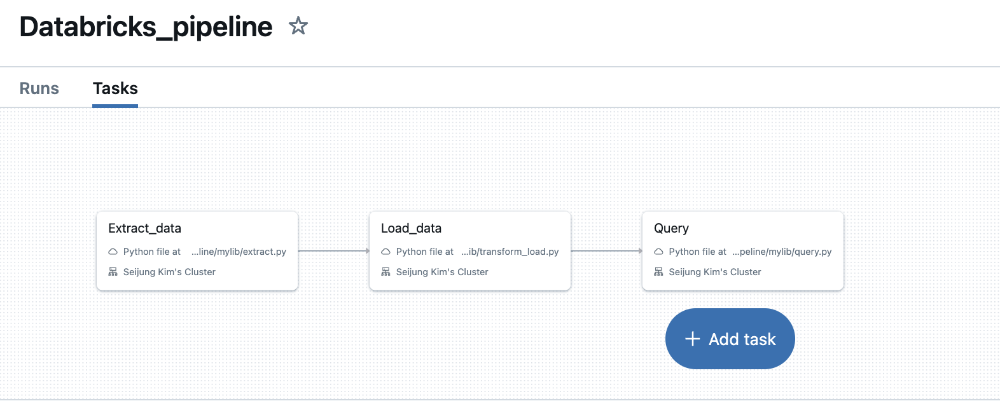

Check CI/CD Status: 

# Mini-project #11
#### Repo Title: Data Pipeline with Databricks
#### Author: Seijung Kim (sk591)

## Project Overview
This project demonstrates how to create a Databricks Pipeline for ETL (Extract, Transform, Load) pipeline and CRUD querying. The dataset contains information about passengers aboard the Titanic, including personal details such as age, sex, and passenger class, along with their survival status. It is commonly used in data science for practice, providing insights into factors that might influence survival rates. It supports basic CRUD (Create, Read, Update, Delete) operations using PySpark DataFrames, enabling efficient data processing for large datasets.

## Requirements/Deliverables
* Create a data pipeline using Databricks
* Include at least one data source and one data sink
* Databricks Python scripts
* Document demonstrating the pipeline

## Dataset
# Titanic Database Schema

This project uses the Titanic passenger dataset, which is commonly used in data science for practice. The following table describes the columns and data types. The dataset was obtained from: https://raw.githubusercontent.com/datasciencedojo/datasets/master/titanic.csv

| Column       | Data Type | Description                                                        |
|--------------|-----------|--------------------------------------------------------------------|
| PassengerId  | INTEGER   | Unique identifier for each passenger                              |
| Survived     | INTEGER   | Survival status (0 = No, 1 = Yes)                                 |
| Pclass       | INTEGER   | Passenger class (1 = 1st, 2 = 2nd, 3 = 3rd)                       |
| Name         | TEXT      | Full name of the passenger                                        |
| Sex          | TEXT      | Gender of the passenger                                           |
| Age          | REAL      | Age of the passenger (in years)                                   |
| SibSp        | INTEGER   | Number of siblings or spouses aboard                              |
| Parch        | INTEGER   | Number of parents or children aboard                              |
| Ticket       | TEXT      | Ticket number                                                     |
| Fare         | REAL      | Fare paid by the passenger                                        |
| Cabin        | TEXT      | Cabin number (if available)                                       |
| Embarked     | TEXT      | Port of embarkation (C = Cherbourg, Q = Queenstown, S = Southampton) |

## CRUD functions for interacting with the dataset:
- create: Adds a new record to the DataFrame.
- read: Displays a specified number of records from the DataFrame.
- update: Updates the artist_name based on PassengerId.
- delete: Deletes a record from the DataFrame based on PassengerId.

## Databricks Workflow Set Up
There are three tasks for the ETL and querying set up in the pipeline.

## How to Run the Databricks Pipeline
1. Navigate to **Workflows** and select your job.
2. Click **Run Now** to execute the pipeline.
3. Monitor task execution:
- The pipeline will run in sequential order: `Extract` > `Load` > `Query`.

